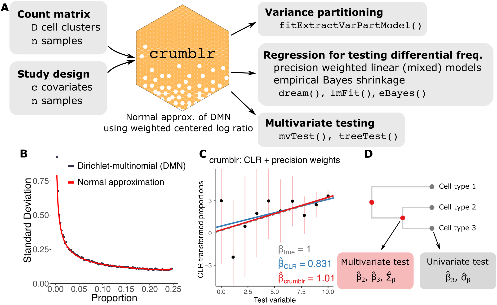

<br>

### <u>C</u>ount <u>r</u>atio <u>u</u>ncertainty <u>m</u>odeling <u>b</u>ased <u>l</u>inear <u>r</u>egression 


<!---

--->

<div style="text-align: justify;">
	
The `crumblr` package enables analysis of count ratio data using precision-weighted linear (mixed) models, PCA and clustering.  `crumblr`'s fast, normal approximation of transformed count data from a Dirichlet-multinomial model allows use of standard workflows to analyize count ratio data while modeling heteroskedasticity.





### Details
Analysis of count ratio data (i.e. fractions) requires special consideration since data is non-normal, heteroskedastic, and spans a low rank space.  While counts can be considered directly using Poisson, negative binomial, or Dirichlet-multinomial models for simple regression applications, these can be problematic since they 1) can be very computationally expensive, 2) can produce poorly calibrated hypothesis tests, and 3) are challenging to extend to other applications.  The widely used centered log-ratio (CLR) transform from [compositional data analysis](https://link.springer.com/book/10.1007/978-3-642-36809-7) makes count ratio data more normal and enables use the linear models, and other standard methods.  

Yet CLR-transformed data is still highly heteroskedastic: the precision of measurements varies widely. This important factor is not considered by existing methods. 

`crumblr` uses a fast asymptotic normal approximation of CLR-transformed counts from a Dirichlet-multinomial distribution to model the sampling variance of the transformed counts.  `crumblr` enables incorporating the sampling variance as precision weights to linear (mixed) models in order to increase power and control the false positive rate.  `crumblr` also uses a variance stabilizing transform (vst) based on the precision weights to improve performance of PCA and clustering.      
</div>


### Install
```r
# 1) Make sure Bioconductor is installed
if (!require("BiocManager", quietly = TRUE)) {
  install.packages("BiocManager")
}

# 2) Install crumblr and dependencies:
# From Bioconductor
# (pending)
# BiocManager::install("crumblr")

# or from GitHub
devtools::install_github("DiseaseNeurogenomics/crumblr")
```

### Introduction to compositional data analysis

- Brief intro for bioinformatics [Quinn, et al. 2018](https://doi.org/10.1093/bioinformatics/bty175)
- Book for analysis in R  [van den Boogaart and Tolosana-Delgado, 2013](https://link.springer.com/book/10.1007/978-3-642-36809-7)
